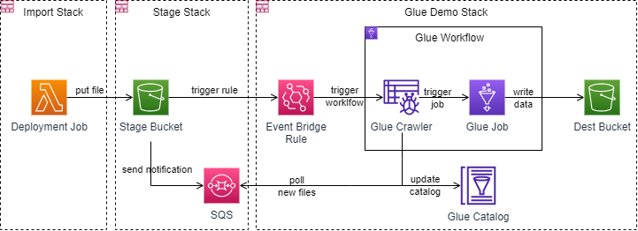

# AWS Glue Pipeline Demo using CDK

This project aims to create a simple data Pipeline using AWS Glue and CDK.
We are going to populate sample data into a source bucket read it through the pipeline and spill it out into another bucket.

## Source Data

The source CSV data comes from [Kaggle](https://www.kaggle.com/blastchar/telco-customer-churn) and it's already been copied into the `source-data` folder. 

## Bootstrap CDK

This pipeline was created using AWS CDK. The first thing you need to do is to [bootstrap](https://docs.aws.amazon.com/cdk/v2/guide/bootstrapping.html) your AWS account.

I created a small helper script to allow you to customize the names of the bootstrap resources. It will update the qualifier inside `cdk.json` as well:

```bash
# ./bootstrap.sh [qualifier]
./bootstrap.sh teststack
```

Example of output:

```yaml
$ ./bootstrap.sh teststack
teststack
 ⏳  Bootstrapping environment aws://NNNNNNNN/us-west-1...
Trusted accounts for deployment: (none)
Trusted accounts for lookup: (none)
Using default execution policy of 'arn:aws:iam::aws:policy/AdministratorAccess'. Pass '--cloudformation-execution-policies' to customize.
cdk-teststack-toolkit: creating CloudFormation changeset...
cdk-teststack-toolkit |  0/12 | 20 h 32 min 51 s | REVIEW_IN_PROGRESS   | AWS::CloudFormation::Stack | cdk-teststack-toolkit User Initiated
...
cdk-teststack-toolkit |  0/12 | 20 h 33 min 02 s | CREATE_IN_PROGRESS   | AWS::IAM::Role          | ImagePublishingRole 
cdk-teststack-toolkit |  0/12 | 20 h 33 min 02 s | CREATE_IN_PROGRESS   | AWS::S3::Bucket         | StagingBucket 
cdk-teststack-toolkit |  0/12 | 20 h 33 min 02 s | CREATE_IN_PROGRESS   | 
...
AWS::IAM::Role          | DeploymentActionRole 
cdk-teststack-toolkit | 12/12 | 20 h 33 min 45 s | CREATE_COMPLETE      | AWS::CloudFormation::Stack | cdk-teststack-toolkit 
 ✅  Environment aws://NNNNNNNN/us-west-1 bootstrapped.
```

## Pipeline Architecture

The app is divided into 3 stacks:



- **Stage Stack**: Creates the Staging Bucket with notification to SQS Queue.
- **Glue Demo Stack**: Creates the AWS glue infra (database, crawler, job, triggers), an EventBridge rule to trigger the workflow and the destination bucket to save data into.
- **Import File Stack**: Deploys a local CSV file into the staging bucket thus triggering the pipeline.

You can run the stacks one at a time:

```bash
cdk deploy teststack-StageStack --require-approval never
cdk deploy teststack-AwsGlueDemoStack --require-approval never
cdk deploy teststack-ImportFileStack --require-approval never
```

## Reference

 - [AWS Glue 101](https://towardsdatascience.com/aws-glue-101-all-you-need-to-know-with-a-real-world-example-f34af17b782f) 
 - [Data Pipeline with AWS CDK and Python](https://medium.com/codex/data-pipeline-using-aws-glue-with-aws-cdk-python-ff2cd4ea18a1)